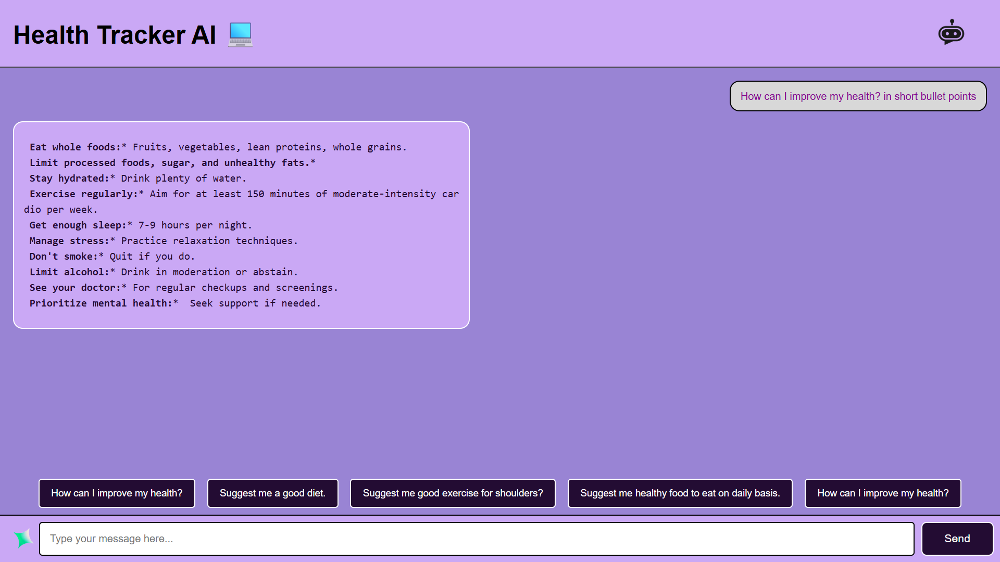

# Career Mentor AI Chatbot 💼

An interactive AI-powered chatbot built with **Flask** and **Gemini 1.5 API** to provide personalized career mentorship and guidance in fields like cybersecurity, interviews, and tech industry trends.

---

## 🖼️ Project Preview



> 💡 *You can customize this chatbot into a Health Advisor, Interview Assistant, or Learning Guide easily.*

---

## 🚀 Features

- 🔐 Career guidance in **Cybersecurity**, **Tech Industry**, **Interview Prep**, and more.
- 💬 Smart replies powered by **Gemini AI**.
- 🧠 Clean and responsive user interface.
- 🎯 Predefined quick questions + custom user input.
- ⚙️ Built with **Flask (Python)**, **HTML**, **CSS**, and **JavaScript**.

---


## 🛠️ Tech Stack

- **Frontend**: HTML, CSS, JavaScript  
- **Backend**: Python (Flask)  
- **AI Engine**: Google Gemini 1.5 API  
- **Runtime**: Localhost / Deployable to Render, Heroku, etc.

---

## 📁 Project Structure

```

├── app.py                 # Flask backend API
├── templates/
│   └── index.html         # Frontend HTML template
├── static/
│   ├── styles.css         # Custom CSS styling
│   └── script.js          # JavaScript logic

````

---

## 🔧 How to Run the Project

1. **Clone this repository**
   ```bash
   git clone https://github.com/your-username/ai-career-mentor-chatbot.git
   cd ai-career-mentor-chatbot

2. **Install the required packages**

   ```bash
   pip install flask google-generativeai
   ```

3. **Configure the Gemini API Key**

   Open `app.py` and replace:

   ```python
   genai.configure(api_key="your_api_key_here")
   ```

4. **Run the Flask application**

   ```bash
   python app.py
   ```

5. **Open your browser** and go to:

   ```
   http://127.0.0.1:5000/
   ```

---

## ✨ Use Cases

* Students exploring tech careers
* Job seekers needing interview practice
* Learners curious about cybersecurity and industry trends

---

## 🙌 Acknowledgements

* Built with 💙 using **Flask** and **Google Gemini API**
* Developed by ~Meet Patel

